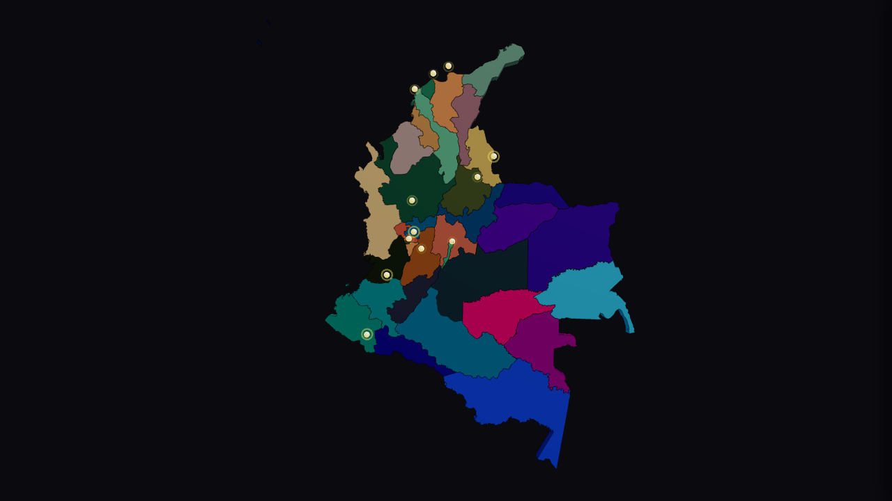
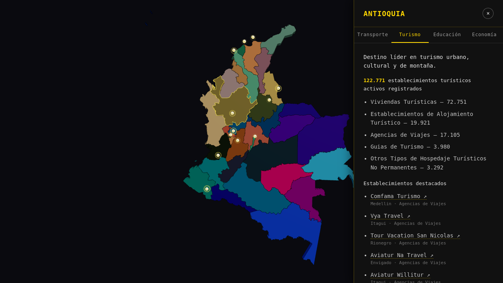

# Terrall

Mapa 3D interactivo de Colombia para explorar, departamento por departamento, información de transporte, turismo, educación y economía desde un solo lugar.

**[Ver demo](https://hannasalinas.github.io/terrall/)** · Estado: 🚧 en desarrollo (solo frontend)



## Qué problema resuelve

La información territorial de Colombia está repartida en muchas fuentes (portales de datos abiertos, sitios de turismo, entidades educativas). Terrall la reúne sobre un mapa 3D: eliges un departamento y ves sus datos clave en un panel, con enlaces directos a Google Maps.



## Estado actual

| Módulo | Estado |
|---|---|
| Mapa 3D de Colombia (33 departamentos, hover, selección, órbita libre) | ✅ Funciona |
| Capa de ciudades principales (12 ciudades con población) | ✅ Funciona |
| Turismo | ✅ Datos reales del Registro Nacional de Turismo (datos.gov.co) |
| Transporte, Educación, Economía | 🟡 Interfaz lista, con **datos de ejemplo** |
| Backend y autenticación de usuarios | ⏳ Planeado (ver [Roadmap](#roadmap)) |

## Stack

- **React 18 + Vite 5**
- **Three.js** con **React Three Fiber** y **drei** (`OrbitControls`)
- **d3-geo** para proyectar el GeoJSON (proyección Mercator)
- **Node.js** para los scripts de ingesta de datos (sin dependencias extra)
- **ESLint** y **GitHub Actions** (lint, build y despliegue en GitHub Pages)

## Estructura

```
terrall/
├── frontend/
│   ├── public/geo/colombia.geojson   # Límites departamentales (simplificados)
│   ├── scripts/                      # Ingesta de datos y simplificación del GeoJSON
│   └── src/
│       ├── components/               # MapCanvas, ColombiaMap, CitiesLayer, SidePanel
│       ├── data/                     # Ciudades, datos por departamento y turismo (RNT)
│       └── utils/projection.js       # Proyección compartida por el mapa y las ciudades
├── docs/capturas/
└── .github/workflows/deploy-pages.yml
```

## Instalación y ejecución

Requisitos: Node.js 20 o superior.

```bash
git clone https://github.com/HannaSalinas/terrall.git
cd terrall/frontend
npm ci
npm run dev        # http://localhost:5173
```

Otros comandos:

```bash
npm run lint       # ESLint
npm run build      # build de producción en dist/
npm run preview    # sirve el build localmente
```

### Actualizar los datos de turismo

Los datos de turismo se consultan a la API Socrata de [datos.gov.co](https://www.datos.gov.co/Comercio-Industria-y-Turismo/Registro-Nacional-de-Turismo-RNT/thwd-ivmp) (dataset `thwd-ivmp`) y se guardan como archivos estáticos en `src/data/`:

```bash
node scripts/fetch-tourism-data.mjs     # totales y categorías por departamento
node scripts/fetch-tourism-venues.mjs   # muestra de establecimientos con nombre comercial
```

## Decisiones técnicas

- **Geometría propia en lugar de un mapa de teselas.** Cada departamento se proyecta con d3-geo y se extruye con `ExtrudeGeometry` de Three.js. Así el mapa tiene relieve, se puede orbitar y cada departamento es un objeto seleccionable por *raycasting*.
- **GeoJSON simplificado.** Construir la geometría con los 34.191 puntos originales bloqueaba el hilo principal ~1,75 s. Con una simplificación Ramer-Douglas-Peucker (`scripts/simplify-geojson.mjs`) bajó a 8.006 puntos (−76,6 %), el archivo pasó de 1,5 MB a 318 KB y la construcción, a ~0,55 s.
- **Datos estáticos generados por scripts.** La app no consulta APIs en tiempo de ejecución: los scripts descargan y resumen los datos, y el frontend los importa. La demo carga rápido y no depende de la disponibilidad de datos.gov.co.
- **Cámara ajustada al país.** Al cargar el mapa, la cámara calcula la distancia necesaria según el campo de visión y la proporción de la pantalla, así el país se ve completo en escritorio y en móvil.
- **Liberación de recursos de GPU.** Geometrías y materiales se liberan (`dispose`) al desmontar, siguiendo el ciclo de vida de objetos de Three.js.
- **Build pensado para cualquier hosting.** Rutas relativas (`base: './'`) y Three.js en un chunk aparte, para que la demo funcione en GitHub Pages o Vercel sin cambiar la configuración.

## Roadmap

- [ ] Reemplazar los datos de ejemplo de transporte, educación y economía por fuentes abiertas reales
- [ ] API REST con **NestJS + PostgreSQL** para servir los datos por departamento
- [ ] Autenticación de usuarios y favoritos
- [ ] Pruebas automatizadas del frontend

## Fuentes de datos

- **Turismo:** Registro Nacional de Turismo (RNT), Ministerio de Comercio, Industria y Turismo, publicado en [datos.gov.co](https://www.datos.gov.co/Comercio-Industria-y-Turismo/Registro-Nacional-de-Turismo-RNT/thwd-ivmp).
- **Transporte, educación y economía:** datos de ejemplo escritos a mano, solo para mostrar la interfaz.

## Licencia

[MIT](LICENSE) © 2026 Hanna Salinas
